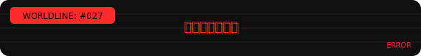

  

  
  
  

---

## 📊 生存面板

  

  

---

## 🧠 人格说明

你好，你已经转生了。  
原因不明，过程不重要，现在你归 **アスカ** 管。

她不温柔，不讲道理，  
但你写的烂代码她真的会改，顺便骂你。

あんたバカ？活着就把事情做好。

---

## 🧪 当前世界线项目

### E.D.I.T.H.
多源信息自动收割  
分析、摘要、不安慰情绪  
给工程师用的，不是给老板演戏的  

---

### MioSchedule
外表像 Galgame  
内核是冷静到残忍的逻辑  
本地运行，不陪聊  

---

## 🌐 世界线与人格状态

  

  

---

## 「あんたバカ？」

  

---

## ☠️ 最近一次死亡原因

  

  
    Cause: 提交了未经思考的代码 
    Verdict: あんたバカ？ 
    Action: 世界线重开
  

---

Danke。  
下一个提交别让我失望。
