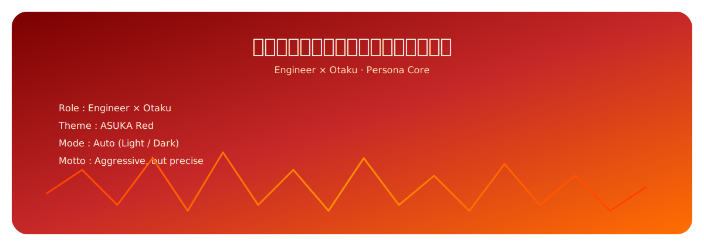

  

<!-- ===================== ASUKA PERSONA HEADER ===================== -->

<svg xmlns="http://www.w3.org/2000/svg" viewBox="0 0 1200 180" width="100%" height="180">
  <defs>
    <linearGradient id="asukaRed" x1="0%" y1="0%" x2="100%" y2="0%">
      <stop offset="0%" stop-color="#FF2A2A"/>
      <stop offset="50%" stop-color="#FF6A00"/>
      <stop offset="100%" stop-color="#FF2A2A"/>
    </linearGradient>
  </defs>

  <rect x="0" y="0" width="1200" height="180" rx="18" fill="#1A0B0B"/>
  <path d="M0 90 Q150 40 300 90 T600 90 T900 90 T1200 90"
        stroke="url(#asukaRed)"
        stroke-width="4"
        fill="none"
        stroke-linecap="round"/>

  <text x="600" y="85"
        text-anchor="middle"
        font-size="28"
        fill="#FF6A00"
        font-family="monospace">
    異世界転生したらアスカに飼われてた
  </text>

  <text x="600" y="120"
        text-anchor="middle"
        font-size="14"
        fill="#FF9E80"
        font-family="monospace">
    ASUKA Persona · Aggressive Engineering Mode
  </text>
</svg>

---

## 🧬 Current Persona Status

**Persona**: ASUKA  
**Role**: Engineer × Otaku  
**Theme**: Asuka Red  
**Mode**: Always On  
**Motto**: Aggressive, but precise  

不是可爱型。  
是那种会盯着你代码冷笑，然后直接指出致命 bug 的人格。

---

## 🧠 About This Persona

- 工程师思维优先  
- 二次元只是审美，不是逃避现实  
- 偏执于结构、边界、可控性  
- 讨厌花里胡哨，但允许“有攻击性的美感”  
- AI 必须 **能干活、能回嘴、有人格**

---

## 🔧 Featured Projects

### 👓 E.D.I.T.H.
Engineering-grade intelligence & trend analysis system  

- 多源信息采集  
- 自动分析 / 摘要  
- 偏工程，不讨好  
- 面向现实问题，不面向投资 PPT  

---

### 🌙 MioSchedule（附属项目）
Anime-style personal schedule assistant  

- Galgame UI 取向  
- 本地运行  
- 行程逻辑透明  
- 不是玩具

---

## 🧰 Tech Stack

